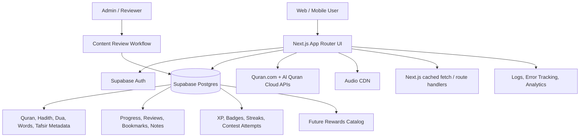
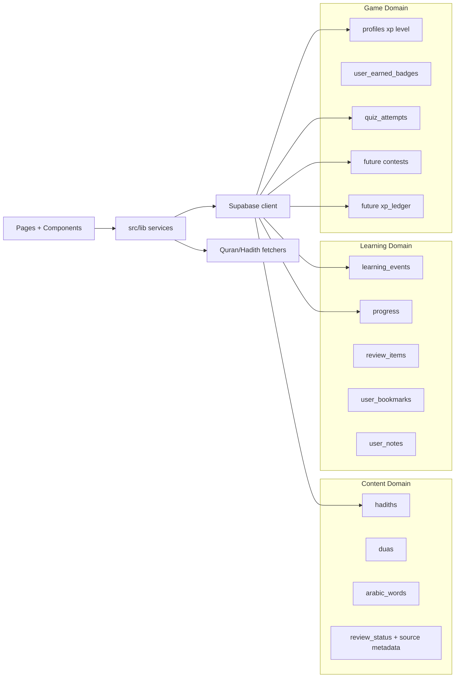

# LearnIslam

**English-first Islamic learning platform for Quran, Hadith, Arabic, duas, quizzes, progress tracking, and future contest-based learning.**

Hindi and Hinglish localization content remains in the codebase behind `ENABLE_LOCALIZED_LANGUAGES` for a future re-enable.

## Features

- **114 Surahs** — Arabic text with English translation and Surah metadata
- **Word-by-Word Mode** — Click any Arabic word to see its meaning
- **Audio Recitation** — Mishary Alafasy's recitation, play full Surah or individual ayahs
- **Quiz System** — Interactive MCQ challenges across 5 categories, 3 difficulty levels (Easy/Medium/Hard)
- **Hadith Learning Tiers** — Must Know, Good to Know, and Deep Dive paths with source and review metadata
- **Progress Dashboard** — Streaks, XP, completed Surahs, quiz accuracy
- **Trust Metadata** — Source, grade, reference, and review status surfaces across learning content
- **Auth** — Sign up / Log in via Supabase

## Production Direction

LearnIslam is moving toward a LeetCode-style learning platform in phases:

1. **Trust + Hadith Foundation** — reviewed sources, hadith tiers, metadata, and transparent attribution.
2. **Structured Learning** — daily paths, weak areas, spaced reviews, saved items, and progress visibility.
3. **Contests** — daily challenges, weekly quiz contests, topic contests, rankings, and post-contest review.
4. **XP Economy** — append-only XP ledger, badges, ranks, streaks, and profile rewards.
5. **Rewards Marketplace** — only after anti-abuse, fraud controls, admin review, and payments are production-ready.

XP is learning-only for the first production versions. Real products, coupons, shipping, and marketplace logic are intentionally future work.

## Architecture

### HLD



### LLD



## Tech Stack

| Layer | Technology |
|-------|-----------|
| Frontend | Next.js 14 (App Router) + TypeScript |
| Styling | Tailwind CSS v4 + shadcn/ui |
| Backend/DB | Supabase (Postgres + Auth) |
| Quran Data | [Al Quran Cloud API](https://alquran.cloud/api) + [Quran.com API v4](https://api-docs.quran.com) |
| Audio | Islamic Network CDN |

## Getting Started

### 1. Clone & Install

```bash
npm install
```

### 2. Setup Supabase

1. Create a project at [supabase.com](https://supabase.com)
2. Run `supabase-schema.sql` in your Supabase SQL editor
3. Enable Email auth in Authentication settings

### 3. Configure Environment

```bash
cp .env.example .env.local
```

Fill in your Supabase URL and anon key in `.env.local`:

```
NEXT_PUBLIC_SUPABASE_URL=https://xxxx.supabase.co
NEXT_PUBLIC_SUPABASE_ANON_KEY=your_anon_key
```

### 4. Run Development Server

```bash
npm run dev
```

Open [http://localhost:3000](http://localhost:3000)

## Pages

| Route | Description |
|-------|-------------|
| `/` | Landing page |
| `/surahs` | All 114 Surahs with English names |
| `/surahs/[1-114]` | Surah reader with English translation, audio, and word-by-word |
| `/hadees` | Hadith learning tier picker |
| `/hadees/must-know` | Essential hadiths every learner should know |
| `/hadees/good-to-know` | Daily life, akhlaq, worship, and common situations |
| `/hadees/deep-dive` | Fiqh, theology, advanced themes, and longer narrations |
| `/quiz` | Quiz difficulty picker |
| `/quiz/easy` | Easy quiz (Surahs 108–114) |
| `/quiz/medium` | Medium quiz (Surahs 67–107) |
| `/quiz/hard` | Hard quiz (Surahs 1–66) |
| `/dashboard` | User progress, streaks, XP |
| `/login` | Login |
| `/signup` | Sign up |

Legacy hadith routes remain temporarily available: `/hadees/easy`, `/hadees/medium`, and `/hadees/hard` map to Must Know, Good to Know, and Deep Dive.

## Database Schema

See `supabase-schema.sql` for the complete schema including:
- `profiles` — user info and XP/level
- `progress` — per-ayah read/memorized tracking  
- `quiz_attempts` — quiz history
- `streaks` — daily streak tracking
- `learning_events` — append-only activity used by daily path and review flows
- `user_bookmarks`, `user_notes`, `review_items` — saved items, private notes, and spaced review
- `contests`, `contest_attempts`, `contest_leaderboard_snapshots` — future contest domain
- `xp_ledger` — future append-only XP source of truth

Hadith content uses `learning_tier` separately from quiz `difficulty`:

| Learning Tier | Legacy Alias | Purpose |
|---------------|--------------|---------|
| `must_know` | `easy` | Essential hadiths every learner should know |
| `good_to_know` | `medium` | Daily life, akhlaq, worship, and common situations |
| `deep_dive` | `hard` | Fiqh, theology, advanced themes, and longer narrations |

Content trust fields should be filled before publishing: `source_name`, `collection`, `book_name`, `chapter`, `hadith_number`, `grade`, `topic`, `review_status`, `reviewed_by`, and `reviewed_at`.

## Verification

```bash
npm run lint
npm run typecheck
npm run build
npm run smoke:routes
```

GitHub Actions runs the same checks on pushes and pull requests.

## Localization Flag

Hindi/Hinglish UI and content fields are preserved for later, but hidden by default. To test them locally, flip `ENABLE_LOCALIZED_LANGUAGES` in `src/lib/feature-flags.ts`.

## Deployment

Deploy to Vercel with one click — all environment variables set in Vercel dashboard.
